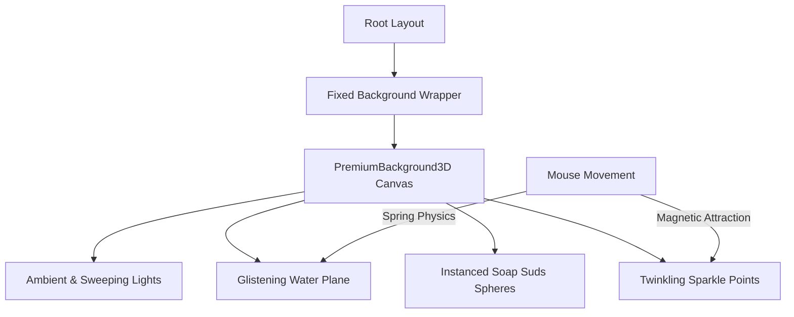

# Sparkling Fluid 3D Background Design Specification

This document details the design and architecture for replacing the local soap bubbles canvas with a global, multi-layered 3D background system representing a sparkling fluid surface. The system combines water wave movement, twinkling sparkles, translucent soap suds, and sweeping light glints.

## 1. Objectives

- **Global Presence**: Rendered in a fixed background layer covering the entire website across all page navigations.
- **Brand Imagery**: Uses elements related to elite, spotless cleaning: water, sparkles, soap suds, and glinting light.
- **High Performance**: Optimized with low-poly geometries, particle instancing, and shader efficiency to prevent lags on mobile devices.
- **Interactivity**: Smooth cursor attraction (swirling sparkles) and wave displacement.

## 2. Technical Approach

### Layered Rendering Pipeline

The background will be rendered within a single Three.js Canvas to maintain a unified lighting model:

#### 1. Glistening Water Plane
- **Geometry**: Deformed `THREE.PlaneGeometry` positioned at the back of the scene.
- **Material**: `THREE.MeshPhysicalMaterial` with:
  - `transmission: 0.6` (highly glassmorphic)
  - `roughness: 0.1`
  - `ior: 1.15`
  - `color: "#EDF3F0"` (subtle matching emerald tint)
- **Animation**: Deformed programmatically using a sine wave function based on time and cursor distance to simulate gentle ripples.

#### 2. Twinkling Sparkle Points
- **System**: `THREE.Points` particle system with 120-150 particles.
- **Geometry**: Star-shaped or cross-shaped custom particle shapes.
- **Shader/Material**: Periodic opacity modulation using a sinusoidal curve (`opacity = 0.3 + Math.sin(time * speed) * 0.7`) to create a natural twinkling effect.
- **Interactivity**: Attracted towards mouse pointer with a slight spring delay, forming a constellation that swirls as the user moves.

#### 3. Soap Suds & Bubbles
- **System**: Instanced mesh of `THREE.SphereGeometry`.
- **Material**: Translucent physical material with thin-film interference properties (oil slick/bubble colors).
- **Animation**: Floating vertically, wiggling laterally using a Perlin-like noise, and resetting when reaching the top.

#### 4. Sweeping Spotlight
- **Light Source**: `THREE.SpotLight` pointing at the water plane.
- **Animation**: Sweeps from left to right along a sinusoidal path, creating beautiful specular glints and flares as it crosses the water plane, sparkles, and bubbles.

## 3. Integration Plan

1. **`components/PremiumBackground3D.tsx` [NEW]**: Implementation of the Three.js multi-layered canvas.
2. **`app/layout.tsx` [MODIFY]**: 
   - Render `<PremiumBackground3D />` inside a `
`.
   - Ensure the layout is optimized for client component loading.
3. **`app/globals.css` [MODIFY]**:
   - Update body background styles to ensure transparent blending (`background-color: transparent` or very high translucency).
   - Ensure `.ambient-bg` uses semi-translucent colors to let the 3D depth shine through.
4. **`components/Hero.tsx` & `components/PageHero.tsx` [MODIFY]**:
   - Remove `<Scene3D />` and update padding/sections to accommodate the global background.

## 4. Verification Plan

### Automated Tests
- Run `npm run build` to verify compilation.

### Manual Verification
- Scroll through the homepage, `/about`, `/services`, and `/areas` to confirm the background is persistent and uninterrupted.
- Test mouse drag on before/after slider and verify background interactions remain fluid.
- Confirm frame rates remain >= 58 FPS on desktop and >= 30 FPS on standard mobile viewports.
